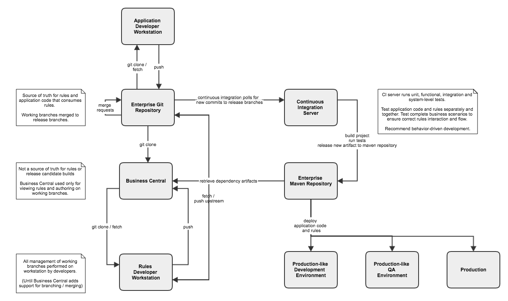
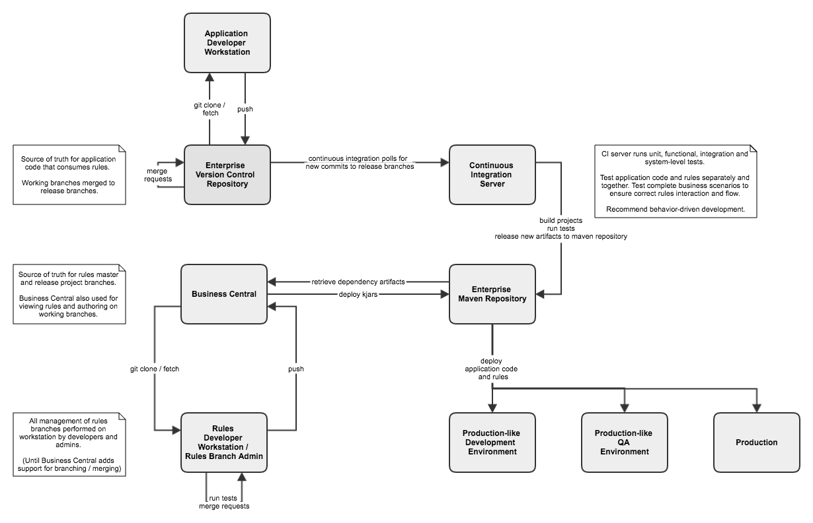

# Red Hat JBoss BRMS 6.x Business Central - CI Integration

## 0. Overview

This document outlines a recommended and alternative approach for using Business
Central as a rules authoring environment which feeds into continuous integration pipelines.

**Note**
Business Central is backed by a local git repository, however, under the 6.x series
branching and merging within the tool is not supported. Therefore in the following
outlines, all git branch administration (branch, merge, etc.) is handled outside of the
tool by developers or admins using local checkouts of the Business Central git.

Future releases of Business Central will likely contain enhanced git support, which may
make local git checkout and administration optional.

For further detail on recommended approach to Business Central git branch administration,
please see the documentation on git workflow:
https://github.com/lzspangler/brms-documents/blob/master/docs/business_central_git_workflow.md 

## 1. Model 1: Dedicated CI Pipelines for Rules Project and Rules Consuming Application

This is the general recommended pattern to integrate Business Central with CI/CD. 

The above assumes a centralized enterprise git repository which acts as the source of 
truth for rules projects and the application code which consumes the rules.

A rules project is created and maintained in the enterprise git repository; release and
long-lived development branches are created; and the project is cloned (once) to 
Business Central from the enterprise git.

Development can be done within Business Central on working branches. Work is not done
directly on release or master branches in Business Central.

Developers clone the project from Business Central to their local working environments
where they can run non-Business Central tests (i.e. JUnit or Cucumber). When satisfied
with the rules development, they will squash the commits made in Business Central and
push the working branch back to enterprise git.

Work on a development branch is reviewed and merged back to the release branch. 
When merges are made into release branches for rules projects or consuming application
code, the CI server builds the project; runs unit, functional, integration and 
system tests; and then releases the artifacts to a central Maven repository.

## 2. Model 2: Dedicated CI Pipeline for Rule Consuming Application 

This is an alternative pattern in the case that a central enterprise git repository is
not available. In this case, the Business Central repository is used as the source of 
truth for the rules projects.

Some drawbacks to this approach are that the Business Central repository may not have
as robust a backup as a centrally maintained enterprise git repository; and rules artifacts
are deployed directly to the Maven repository without the benefit of going through a CI
pipeline.

Under this model, a rules project is created and maintained in Business Central. An
administrator would checkout the project, create master, release and working branches
and then push back to Business Central.

Development is still done on working branches, and work is not done directly on release 
or master branches in Business Central.

Developers run non-Business Central tests on their own local checkouts, and squash 
commits when done working on a feature. 

The working branches are pushed back to Business Central, and an administrator or lead
pulls. Code review and merge are done by admin/lead on their own checkouts. Updated
release branches are pushed back to Business Central. 

In Business Central, and administrator can open the project, switch to the release branch,
and build and deploy to release the kjar to the central Maven repository.

