# Red Hat JBoss BRMS 6.x Business Central Cool Store Demo

## 0. Introduction

The following steps demonstrate the process of creating a new rules project in BRMS 6.x Business Central with a retail store shopping cart example. This demonstration covers:
- Organizational Units
- Git Repositories
- Rules Projects
- DSL Rules
- Guided Editor Rules
- DRL Rules
- Guided Decision Tables
- Rule Flow Processes

<br />** Note **<br />
This document is an adapted version of Eric Schabell's BRMS 6 Cool Store Demo:
http://www.schabell.org/2014/03/redhat-jboss-brms-v6-coolstore-demo.html
https://bpmworkshop.github.io/brms6_1/lab01.html#/
https://github.com/jbossdemocentral/brms-coolstore-demo/tree/v2.0

<br />

## 1. Creating a New Organizational Unit, Git Repository and Project

Create a new Organizational Unit with an enclosed git repository and new Kie project.

- Navigate to:
	- AUTHORING -> ADMINSTRATION
	- ORGANIZATIONAL UNIT -> MANAGE ORGANIZATIONAL UNITS -> ADD
	- Enter:
		- Name: Demos
		- Default group ID: com.redhat.demos
		
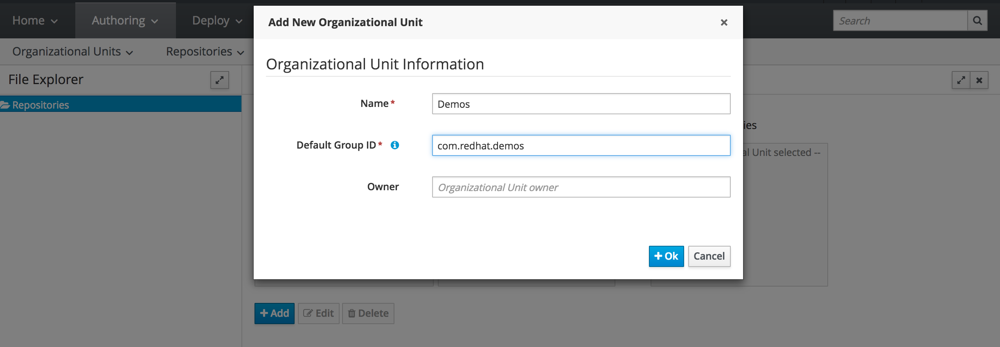
	
- Navigate to:
	- REPOSITORIES -> NEW REPOSITORY
	- Enter:	
		- Repository Name: coolstore-demo
		- In Organizational Unit: Demos

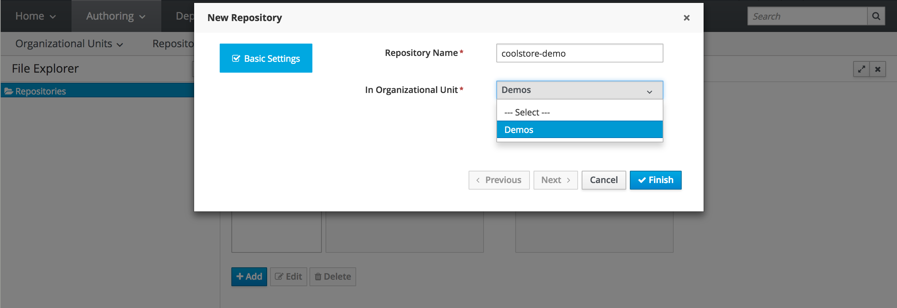

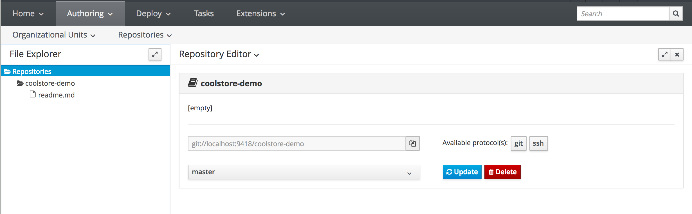

- Navigate to:
	- AUTHORING -> PROJECT AUTHORING
	- NEW ITEM -> PROJECT
	- Enter:
		- Project Name: coolstore
		- Project Description: JBoss BRMS Cool Store project
		- Group ID: com.redhat.demos
		- Artifact ID: coolstore
		- Version: 1.0.0

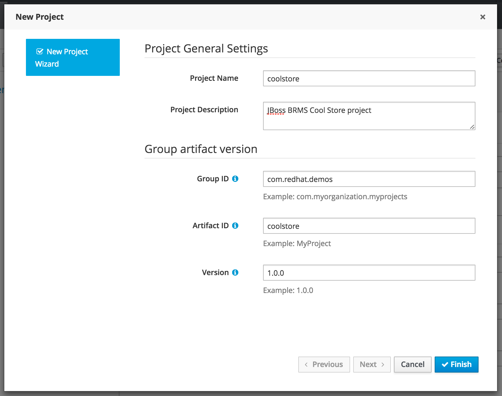

- Navigate to:
	- PROJECT EXPLORER -> coolstore/src/main/resources/META-INF/kmodule.xml
	- Add the following KieBase definition:
		
```	
	<kbase name="coolstore-kie-base" default="true" equalsBehavior="equality">
    	<ksession name="coolstore-stateful-kie-session" type="stateful" default="true" />
  	</kbase>
```
	
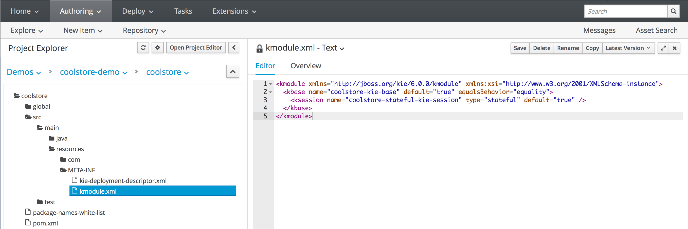
	
<br />** Note **<br />
If a KieBase is not explicitly defined in a rules project's kmodule.xml, a default KieBase and KieSession with reasonable defaults will be assumed.
See the drools documentation for further detail:
https://docs.jboss.org/drools/release/6.4.0.Final/drools-docs/html_single/#KIEBuildingSection

<br />

## 2. Importing a Domain Model

Make a Java fact model available to the Kie project.

- Clone and build the brms-coolstore-model from the /sources directory of this documentation repo

- Navigate to:
	- AUTHORING -> ARTIFACT REPOSITORY -> UPLOAD
	
	- Upload the brms-coolstore-model-1.0-SNAPSHOT.jar to the Business Central artifact repository
	
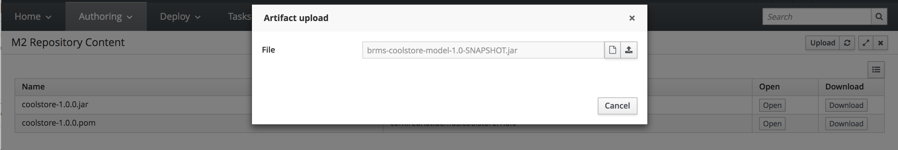
	
- Navigate to:
	- AUTHORING -> PROJECT AUTHORING -> coolstore/pom.xml
	- Add the following dependency to the pom and save:


    <dependencies>
    	<dependency>
        	<groupId>com.redhat</groupId>
        	<artifactId>brms-coolstore-model</artifactId>
        	<version>1.0-SNAPSHOT</version>
    	</dependency>
	</dependencies>


<br />** Note **<br />
For simplicity, in this demo we are uploading the domain model jar through Business Central, which installs to Business Central's m2 directory. 
It is also possible to connect Business Central to an external maven repository from which to pull dependencies.
The domain model could even be authored in Business Central itself, however, most applications will already have a Java domain defined elsewhere.

<br />

## 3. Cloning to a Local Workspace and Creating Release and Working Branches

Create release and working git branches to facilitate development lifecycle.

<br />
- Ensure the following lines are in `~/.ssh/config`

```
    Host *
            VerifyHostKeyDNS no
            StrictHostKeyChecking no
            HostKeyAlgorithms +ssh-dss
            PubkeyAcceptedKeyTypes +ssh-dss
            UserKnownHostsFile /dev/null
```

- Ensure that `~/.ssh/config` has these access rights: `-rw-------`

```
    chmod 600 ~/.ssh/config
```

- Navigate to:
	- AUTHORING -> ADMINISTRATION -> REPOSITORIES -> LIST
	
	- Choose the ssh protocol option under the coolstore-demo repository
	
	- Copy the ssh location for the Business Central coolstore-demo repository
		- i.e. ssh://localhost:8001/coolstore-demo
		
	- Change to a location in your local file system to clone the repository
		- git clone <ssh location> 
		- Use your Business Central password to authenticate

	- Create a release branch (1.0.0) and a working branch (dev_1.0.0)
		- git checkout -b 1.0.0
		- git checkout -b dev_1.0.0
	
	- Push the branches back to Business Central
		- git push origin 1.0.0
		- git push origin dev_1.0.0
		
	- View branches in Business Central
		- Restart the Business Central server
		- Navigate to AUTHORING -> PROJECT AUTHORING
		- Select the coolstore-demo project
		- Find the branch options in the Project Explorer
		- Switch to the branch dev_1.0.0
		

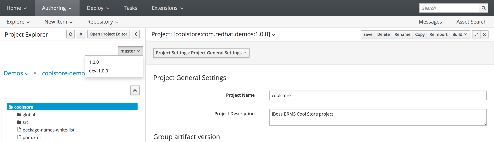

		
<br />** Note **<br />
As of writing, in current version of BRMS (6.4.0-GA), Business Central does not support branching and merging operations within the tool. Therefore these operations must be handled outside of Business Central and pushed back.

<br />** Note **<br />
Also as of writing, Business Central requires a server restart in order to recognize new branches pushed to its repository.
New commits to branches that Business Central already recognizes will appear without restart, however.

<br />** Note **<br />
There are two places in Business Central where branches appear: in Authoring/Project Authoring and Authoring/Administration/Repositories. 
In order to work on a branch, make sure that you have switched to that branch in the Project Authoring view. The repository does not need to be switched from master in the Repositories view.

<br />

## 4. Authoring Rules with DSL

Add a DSL definition and create a guided rule to use it.

- Navigate to:
	- AUTHORING -> PROJECT AUTHORING
	- NEW PACKAGE 
		- Create a new package 'promotions'
	- NEW ITEM -> DSL DEFINITION
		- Create a new DSL definition 'promotions'
		
```	
		[when]If customer spends ${var}=$shoppingCart : ShoppingCart( cartItemTotal >= {var} )
		[then]Apply Free Shipping=$shoppingCart.setShippingPromoSavings( $shoppingCart.shippingTotal * -1 ); $shoppingCart.setShippingTotal( 0 ); update( $shoppingCart );
```
- NEW GUIDED RULE
	- Create a new guided rule 'free_shipping_promotion'
	- Check the option to use DSL
	- Add WHEN condition
		- If customer spends $75 
	- Add THEN condition
		- Apply Free Shipping
	- Add Attributes
		- no-loop true
		- ruleflow-group promo-rules
- Under the DATA OBJECTS tab add an import for the ShoppingCart object
- Save and validate
			
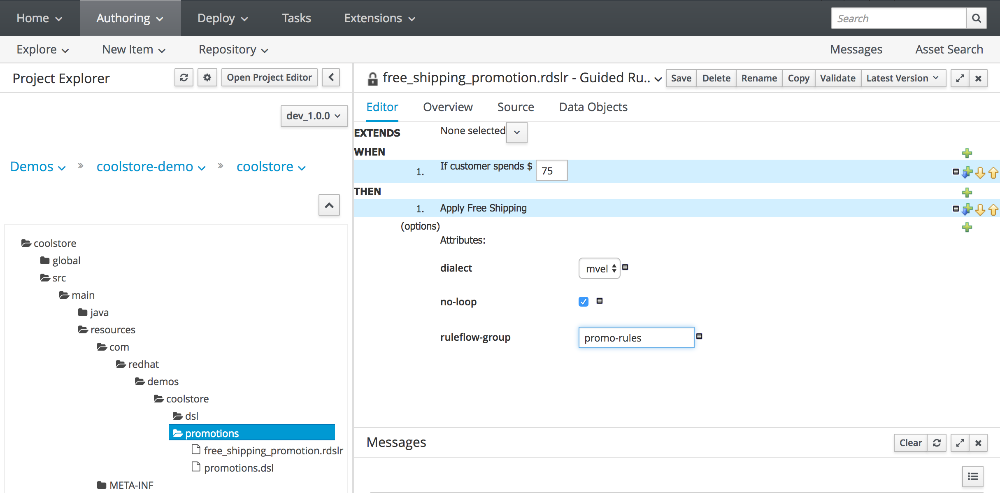

	
<br />** Note **<br />
At this time DSL definitions must be placed in the same package as the rules which use them.
	
<br />

## 5. Authoring Rules with The Guided Rule Editor

Create a rule using only the guided rule editor.

- NEW PACKAGE 
	- Create a new package 'totals'
- NEW GUIDED RULE
	- Create a new guided rule 'shopping_cart_totals'
	- Leave the option to use DSL unchecked
- Under the DATA OBJECTS tab add an import for the ShoppingCart object
- Add a WHEN condition
	- 'There is a ShoppingCart'
	- Assign the cart to a variable '$shoppingCart'
- Add a THEN condition
	- 'Modify $shoppingCart' 
	- Set cartTotal to literal value: 
		- 0.0
	- Set cartItemPromoSavings to the formula:
		- ($shoppingCart.cartItemPromoSavings == 0.0) ? 0.0 : $shoppingCart.cartItemPromoSavings * -1
- Add attributes
	- no-loop true
	- ruleflow-group total-rules
- Save and validate
		
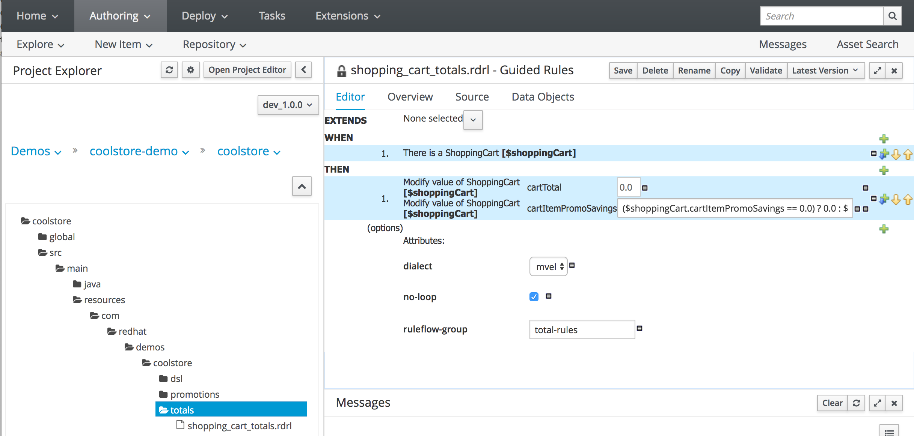

<br />

## 6. Authoring Rules with Free DRL

Create a free DRL rule.

- NEW PACKAGE 
	- Create a new package 'pricing'
- NEW DRL File
	- Create new DRL file total_shopping_cart_items
- Paste the following rule definition:
	
```	
	package com.redhat.demos.coolstore.pricing;

	import com.redhat.coolstore.model.ShoppingCart;
	import com.redhat.coolstore.model.ShoppingCartItem;

	rule "total_shopping_cart_items"
	ruleflow-group "pricing-rules"
	no-loop true
	when
 	   $shoppingCart : ShoppingCart()
 	   $shoppingCartItem : ShoppingCartItem( shoppingCart == $shoppingCart )
	then
    	$shoppingCart.setCartItemTotal( $shoppingCart.getCartItemTotal() + ($shoppingCartItem.getPrice() * $shoppingCartItem.getQuantity() ));
    	$shoppingCart.setCartItemPromoSavings( $shoppingCart.getCartItemPromoSavings() + ($shoppingCartItem.getPromoSavings() * $shoppingCartItem.getQuantity()));
    	update( $shoppingCart );
    	retract( $shoppingCartItem );
	end
```	

- Save and validate

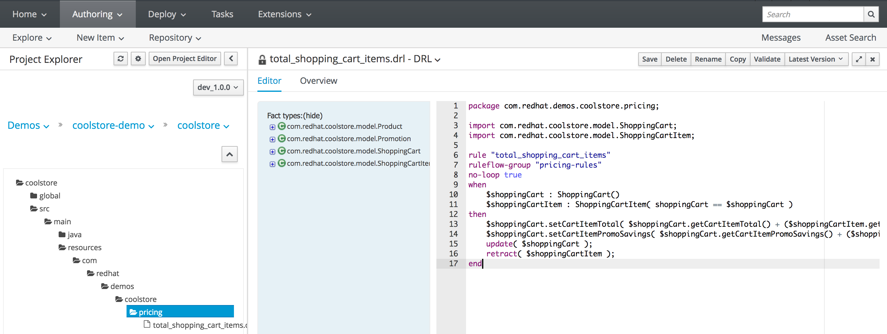

<br />

## 7. Authoring Rules with The Guided Decision Table Editor

- NEW PACKAGE 
	- Create a new package 'shipping'
- NEW GUIDED DECISION TABLE
	- Create a new guided decision table 'shipping_rules'
- Summary
	- Name: shipping_rules
- Imports
	- Import the ShoppingCart
- Add Fact Patterns
	- Bind the ShoppingCart to the variable $shoppingCart
- Add Constraints
	- cartItemTotal greater than or equal to
		- Add cartItemTotal to Conditions
		- Column Header: "Total >="
		- Operator: greater than or equal to
	- cartItemTotal less than
		- Add cartItemTotal to Conditions again
		- Column Header: "Total <"
		- Operator: less than
- Add Actions to update Facts
	- Select $shoppingCart : ShoppingCart
	- Select shippingTotal
	- Column header: "Shipping Total"
	- The rest of the fields can be left empty
- Add Actions to insert Facts
	- No action needed
- Columns to expand
	- Ensure box is checked to expand the table
- Add columns for no-loop and ruleflow group
	- Select + New Column
	- Select Add a new Metadata\Attribute column
	- Check the no-loop box
	- Set the ruleflow-group to "shipping-rules"

- Add the following tabular data:

```
		Description		Total >=	Total <		Shipping Total
		Shipping Tier 1		0		25		2.99
		Shipping Tier 2		25		50		4.99
		Shipping Tier 3		50		75		6.99
		Shipping Tier 4		75		100		8.99
		Shipping Tier 5		100		1000000		10.99
		
```	
		
- Save and validate
		
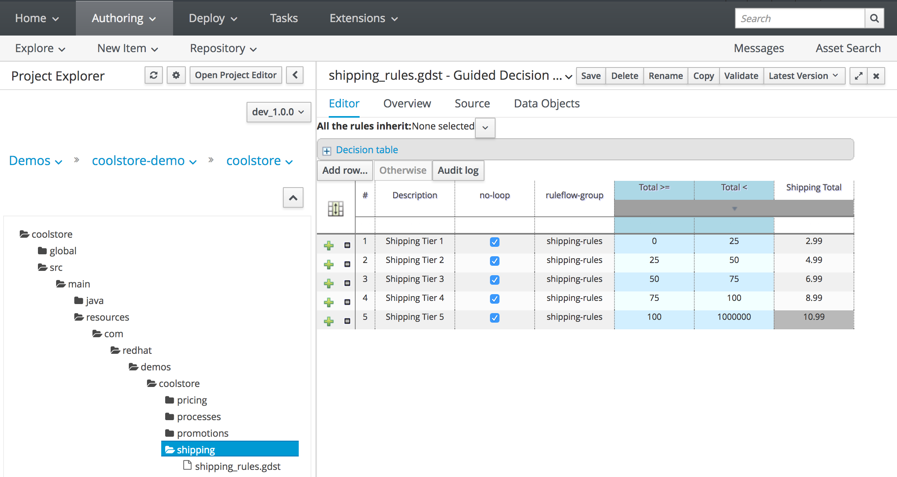

<br />	

## 8. Creating a Business Process to Orchestrate Rules Execution

- NEW PACKAGE 
	- Create a new package 'processes'
- NEW BUSINESS PROCESS
	- Create a new business process called 'PriceProcess'
- From the start node, drag to create 5 new nodes and then an end node
- Set the nodes to TaskType Business Rule
- Label the nodes as follows
	- Total Shopping Cart Items
	- Calculate Shipping
	- Apply Shipping Promotions
	- Total Shopping Cart
- Assign the nodes to ruleflow groups as follows:
	- Total Shopping Cart Items		-> 		pricing-rules
	- Calculate Shipping			-> 		shipping-rules
	- Apply Shipping Promotions		-> 		promo-rules
	- Total Shopping Cart			-> 		total-rules
	
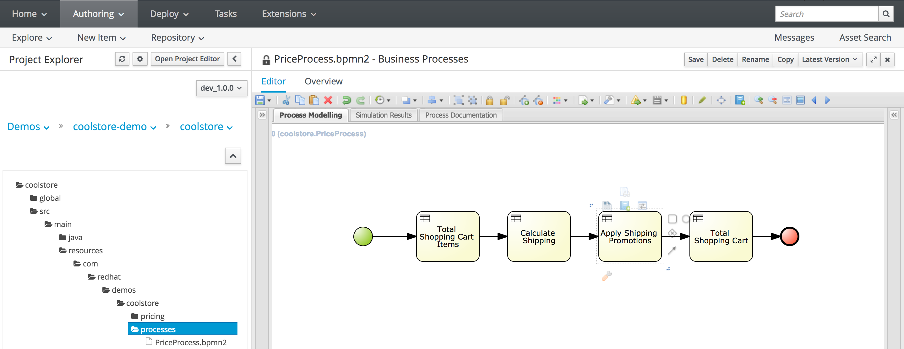


