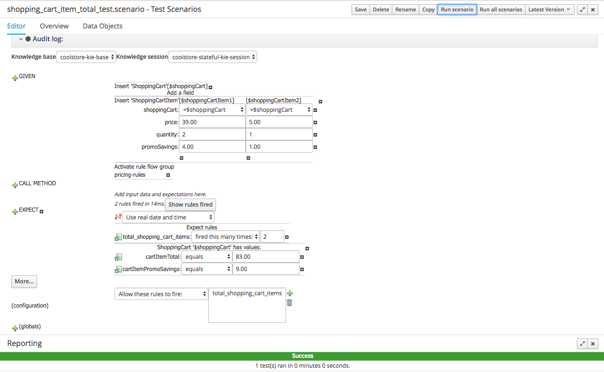
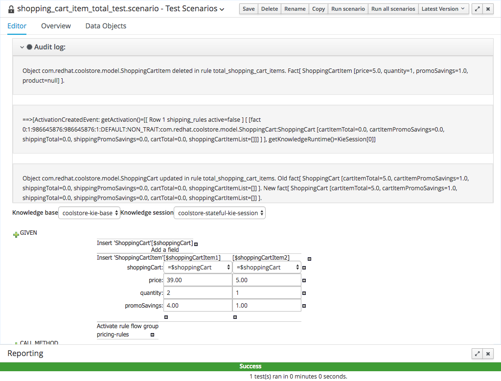
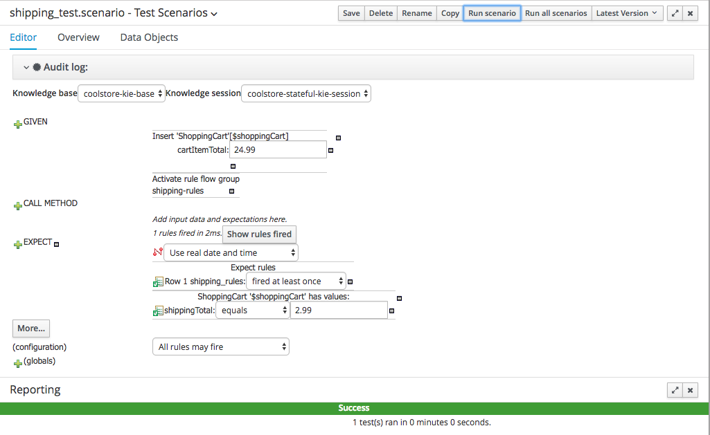
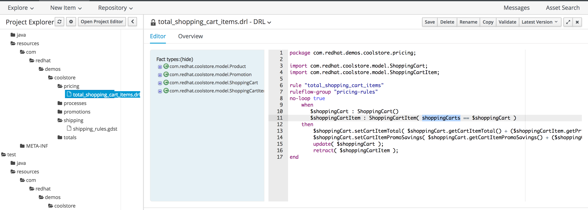
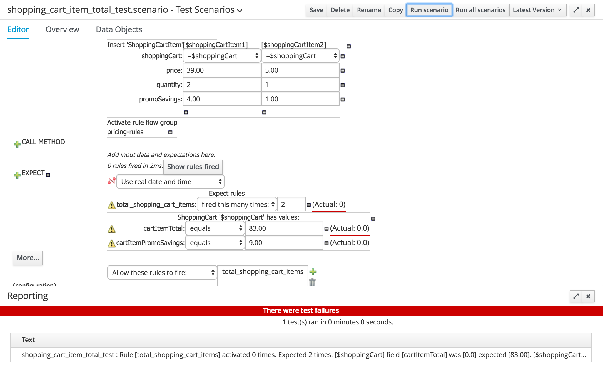
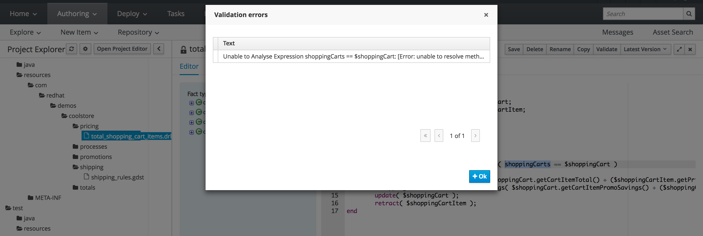
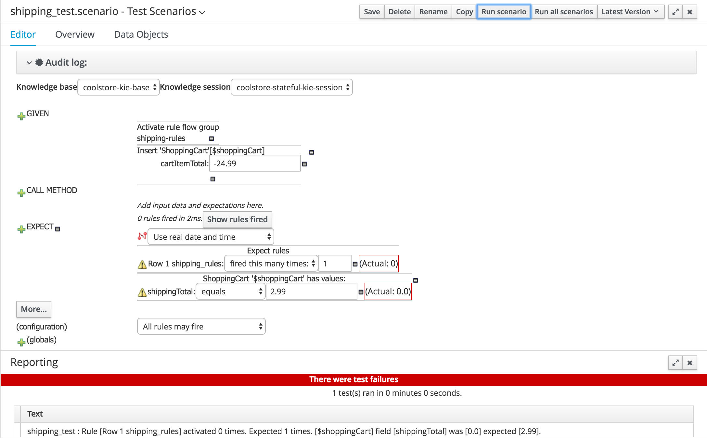
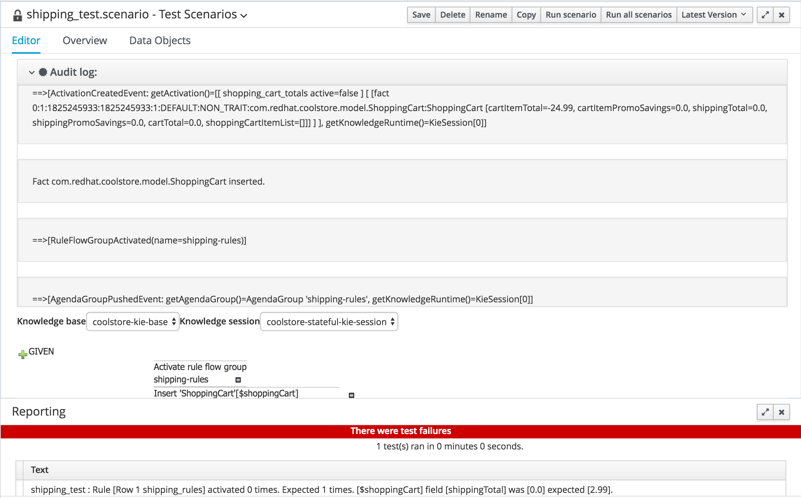
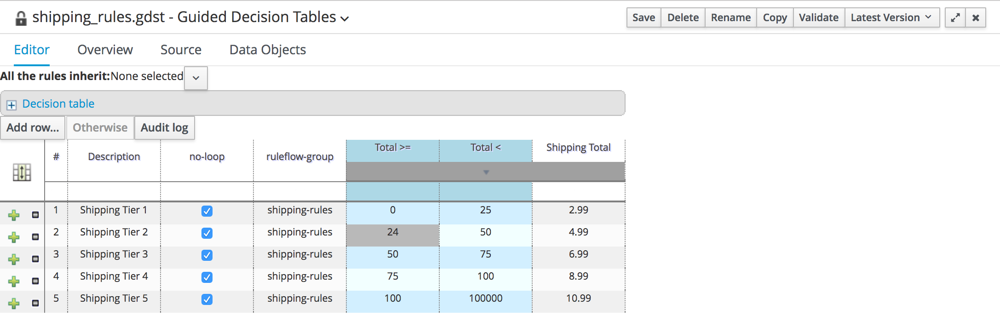
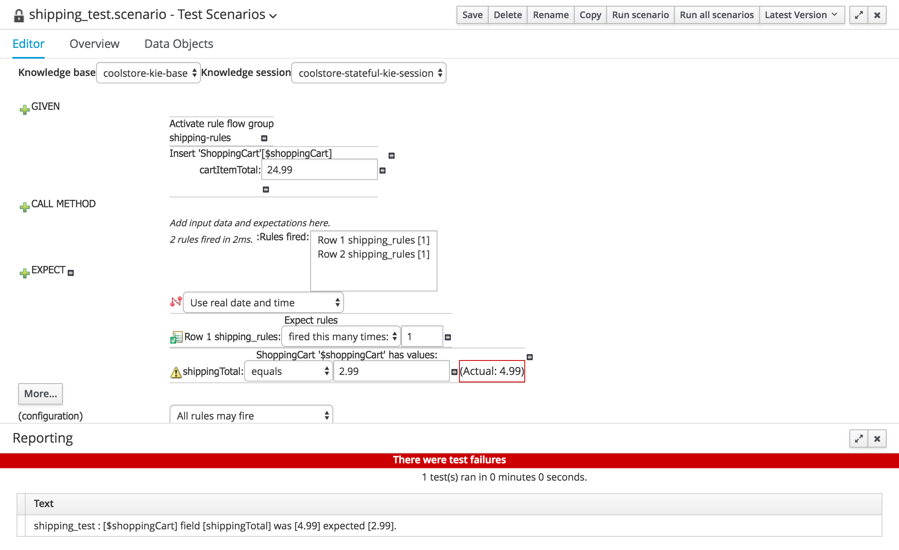

# Red Hat JBoss BRMS 6.x Business Central Cool Store Demo - Testing

## 0. Overview

Because business rules are loosely-coupled and discrete units of logic, just like logic 
embedded in application code, rules can and should be tested on multiple levels of execution:

- Unit testing of individual rules
- Unit testing of ruleflow-groups
- Unit testing of business processes
- Functional testing of business requirements and scenarios

Functional testing to validate the correctness and business validity of a rules-based
application is essential, but unit tests can help organize rules and promote thoughtful
design during development ('build the right thing' vs. 'build the thing right').

This exercise will provide an overview of the unit testing capabilities available in 
Business Central version 6.2 to 6.x.

It builds on the rules setup previously in the rules authoring demo found here:
https://github.com/lzspangler/brms-documents/blob/master/docs/business_central_coolstore_demo.md

**Note**

Notes on test tooling in current Business Central:
- Business Central is only capable of unit testing
- Test scenarios can be configured to execute:
	- Kie bases
	- Kie sessions
	- Individual sets of rules or ruleflow groups
- Test data setup is a manual process in the UI for each scenario
- Debugging capabilities are limited
- If a rule under development causes looping when it is executed, the Business Central 
server may require restart
- Tests cannot be run outside of Business Central and therefore cannot be included in a CI build

**Note**

It should be emphasized that unit testing of individual rules or ruleflow groups is not 
enough on its own.

Due to the fact that rules do not execute in a strict sequence, and some rules can 
influence or interfere with the execution of other rules, drools rules artifacts must 
always be tested as they would be run in a production environment and according to 
expected business scenarios.

Therefore any unit testing in Business Central (or outside of Business Central) should 
be in addition to automated functional application testing.

**Note**

This document is an adapted version of material in Eric Schabell's BRMS 6 Cool Store Demo: 
http://www.schabell.org/2014/03/redhat-jboss-brms-v6-coolstore-demo.html 
https://bpmworkshop.github.io/brms6_1/lab01.html#/ 
https://github.com/jbossdemocentral/brms-coolstore-demo/tree/v2.0

## 1. Testing an Individual Rule

- Navigate to AUTHORING -> PROJECT AUTHORING -> NEW ITEM -> TEST SCENARIO
- Create a new test called 'shopping_cart_item_total_test' in the package 
com.redhat.demos.coolstore.pricing
- Check that you are running the test against the knowledge base coolstore-kie-base and knowledge session coolstore-stateful-kie-session
- Go to Data Objects and import com.redhat.coolstore.model.ShoppingCart
- Go to Data Objects and import com.redhat.coolstore.model.ShoppingCartItem
- Change the configuration to 'Allow these rules to fire: total_shopping_cart_items'
- Add Givens 
	- To insert a ShoppingCart object called $shoppingCart
	- Insert a ShoppingCartItem called $shoppingCartItem1
	- Insert a ShoppingCartItem called $shoppingCartItem2
	- On $shoppingCartItem1, set the:
		- shopping cart to $shoppingCart
		- price 39.00
		- quantity 2
		- promoSavings 4.00
	- On $shoppingCartItem2, set the:
		- shopping cart to $shoppingCart
		- price 5.00
		- quantity 1
		- promoSavings 1.00
	- Activate the 'pricing-rules' ruleflow group
- Add Expects
	- That the 'total_shopping_cart_items' rule fires 2 times
	- That the $shoppingCart has cartItemTotal 83.00 and cartItemPromoSavings 9.00
- Save and run the scenario
- Notice the 'Audit log' that appears after the test ran, click to expand and view audit 
log information

## 2. Testing a RuleFlow Group

- Navigate to AUTHORING -> PROJECT AUTHORING -> NEW ITEM -> TEST SCENARIO
- Create a new test called 'shipping_test' in the package com.redhat.demos.coolstore.shipping
- Go to Data Objects and import com.redhat.coolstore.model.ShoppingCart
- Set the configuration to 'All rules may fire'
- Add Givens
	- Add a ShoppingCart called $shoppingCart with a cartItemTotal of 24.99
	- Activate the 'pricing-rules' ruleflow group	
- Add Expects
	- The rule 'Row 1 shipping-rules' fires once
	- The $shoppingCart has been updated with a shippingTotal of 2.99
- Save and run the scenario
- Change the value of the cartItemTotal to see that a different rule ran (any rule in 
the ruleflow group is able to run)

**Note**

Chaining tests together in one business central test scenario can be done by clicking the 
'More...' button toward the bottom of the test. 

Although this can be done, data from one scenario will persist into the next scenario 
unless otherwise handled. Care should be taken with fields from previous tests to reset 
the objects and ensure tests do not bleed into one another. This may not be less work 
than putting tests into separate files. Multiple tests in one file can also be more 
difficult to read.

## 3. Evaluating Test Failures

In most cases, when a rule does not execute as expected it is because:
- The rules are not written to behave as expected
- The facts in the session do not have the expected state
- Rules are interacting in an unintended way

**Rules Not Written as Expected:**

- Open the rule 'total_shopping_cart_items' in src/main/resources/com.redhat.demos.coolstore.pricing
- On line 11 change the field name 'shoppingCart' to 'shoppingCarts' and save

- Run the test 'shopping_cart_total_test.scenario' in src/test/resources/com.redhat.demos.coolstore.pricing

- Look at the failures and see that the three test expectations were not met

- Notice also that there were 0 rules fired, and confirm in the audit log
- Go back to the 'total_shopping_cart_items' rule and click the 'Validate' button

- Review the compilation error and change 'shoppingCarts' back to 'shoppingCart'
- Save and rerun the test, it should succeed now

**Note**

In the case of a rule compilation error, drools will evaluate the left hand side of the
rule to 'false' and will not produce any error otherwise. 

To check for test failures due to rule compilation issues, use the 'validate' button
in the rule editing view to compile. If the rule or rules fail to compile, an error
message will be shown in Business Central. To build all of the rules in a project, you
can use the 'Build and Deploy' option in the project editor view.

**Facts in Unexpected State:**

- Open the 'shipping_test.scenario' in src/test/resources/com.redhat.demos.coolstore.shipping
- In the 'Given' statement which inserts the ShoppingCart, change the cartItemTotal to -24.99
- Run the test and examine the failure messages

- View the audit log, this audit log does not show the object's state when inserted but
in this case you can see the state (cartItemTotal=-24.99) in other rule activations

- Compare the cartItemTotal of -24.99 with the handled range of rules defined in the
'shipping_rules' decision table in src/main/resources/com.redhat.demos.coolstore.shipping
- Change the cartItemTotal back to 24.99 in the test, save and rerun

**Rules Interacting in Unintended Ways:**
- Open the 'shipping_rules' decision table in src/main/resources/com.redhat.demos.coolstore.shipping
- Change the 'Total >=' column in Shipping Tier 2 to 24

- Run the test 'shipping_test.scenario' in src/test/resources/com.redhat.demos.coolstore.shipping
- Review the failure messages and notice that two rules fired: 'Row 1 shipping_rules[1]' and 'Row 2 shipping_rules[1]'

- Review the rules in the 'shipping_rules' decision table and notice that these two rules 
have overlapping conditions (total is between 0-24.99, and total is between 24.00-49.99
- Correct the overlap, save and rerun the test

**Note**

The error messaging and debugging capabilities available in Business Central are limited
to basic messaging when expect statements are not met, a list of rules fired, and a 
simple audit log.

If errors cannot be immediately diagnosed by checking fact state or reviewing the rules,
the code can be pulled from Business Central to a development environment which has 
more robust debug tooling available

This would be another advantage to writing unit tests outside of Business Central.

