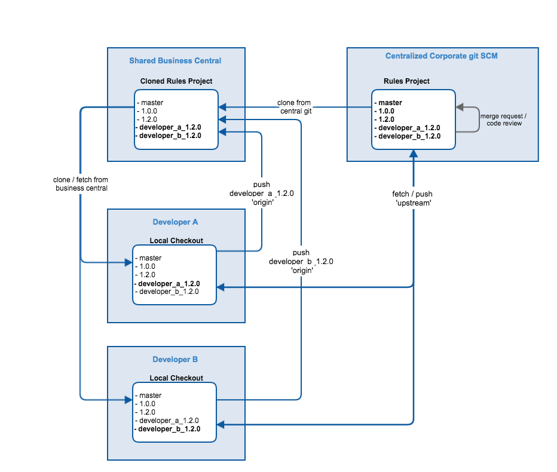

# Red Hat JBoss BRMS 6.x Business Central Git Development Workflow

## Introduction and Motivation

This document presents a recommended git-based development workflow using a deployed Business Central instance as a shared rules authoring environment. 

The document assumes a dev team following a standard git workflow such as:
 http://nvie.com/posts/a-successful-git-branching-model/
 https://guides.github.com/introduction/flow/

The process outlined here is intended for use with Business Central 6.x at or above version 6.2. At this time, the Business Central 6.x series supports the following basic git integrations:

- Clone existing git repositories into Business Central
- Work on branches within Business Central's local repo checkout

Because Business Central does not currently support branching and merging within the tool, this document describes a process for performing rules updates on working branches and merge of work back to release branches--using a local development git repository to mediate between Business Central git and the central enterprise git.

Additional git support is planned for the 7.x release, and an updated workflow process will follow.

 ** Note ** 
This document is a summarized version of Donato Marrazzo's git workflow notes found here: 
https://github.com/dmarrazzo/rh-bpm-notes/blob/master/git_workflow.md

Please see the above for further detail.

 

## Architecture and Workflow Overview

The main architectural components are:
- Centralized enterprise git repository environment where the project's master and release branches are maintained
- Centralized development Business Central instance with repository cloned from enterprise git repo
- Long-lived developer working branches, used to develop features and merge back to release branches
- Developer workstations

In a typical workflow a developer would:
- Clone the Business Central git repository to local development environment
- Ensure their personal working branch is up to date with target release branch in enterprise git
- Push working branch from local to Business Central
- Login to Business Central, switch to their branch, add or change rules and save
- On local, pull updated working branch from Business Central
- Squash commits on working branch
- Fetch and merge from enterprise git, ensure working branch is up to date
- Push working branch back to enterprise git and start merge request/pull request process
- After merge, ensure working branch is up to date with release branch and ready to start work on a new story/feature

 

## Enterprise git Setup

Assuming that developers each have a username in the git repository and can fetch/push:

**Create a Working Branch for Each Developer**
- Each developer has a working branch for the central rules git repository
- These branches are long-lived and will be used to develop successive features
    - This is in contrast with more typical 'feature branches' which would be disposed of after feature work is merged back to a mainline branch
    
 ** Note ** 
The reason for using long-lived working branches is due to the fact that Business Central currently requires restart to recognize new branches in its repository (although updates to working branches are registered).

 

## Configuration on Business Central

**Add a User for Each Developer**
- Use the add-user.sh script in the <JBOSS HOME>/bin
- Add each developer with either the 'developer' or 'admin' role
- Set a password for each user
- On restart of Business Central, developers should be able to login under their own user

**Clone Repository from Enterprise Git to Business Central**
- Login to Business Central as an admin user
- Go to Authoring/Administration/Repositories/Clone repository and fill out:
	- Repository Name
	- Organizational Unit
	- Git URL
	- User Name
	- Password
- Repository will be viewable in Authoring/Administration/Repositories/Repository Editor

  **Note**  
There is no need to switch branch from 'master' in the Repository Editor.

 

## Configuration on Local Developer Environment 

**Local SSH Config**

Add the following lines to `~/.ssh/config`

    Host *
            VerifyHostKeyDNS no
            StrictHostKeyChecking no
            HostKeyAlgorithms +ssh-dss
            PubkeyAcceptedKeyTypes +ssh-dss
            UserKnownHostsFile /dev/null

Ensure that `~/.ssh/config` has these access rights: `-rw-------`

    chmod 600 ~/.ssh/config
    
**Clone Repo from Business Central to Local**
- Have an admin user retrieve the SSH (not git) location for the Business Central git repository where work is to be done
- Clone this location to developer local checkout
- Use Business Central password for the user

**Add Central Enterprise Repo to Local Checkout**
- In order to fetch and push from enterprise git, calling the enterprise git 'upstream':

    $ git remote add upstream <team_repo_url>

 

## Working in Business Central

Once the above steps have been completed, each developer can login to Business Central using their own credentials and switch to their branch to begin working.

- Pull and push from/to origin to update working branch in Business Central 
	- git push origin developer_a_1.2.0
	- git fetch origin developer_a_1.2.0
	
- Pull and push from/to upstream to keep working branch up to date with mainline branches and submit new work for merge to mainline branches in enterprise git
	- git fetch upstream 1.2.0
	- git push upstream developer_a_1.2.0

 ** Note ** 
Business Central currently does not support limiting the visibility of branches based on user or role. Therefore developers must be careful to work only in their own branches. It's recommended that once a developer logs in to Business Central for the first time, they change to their dedicated working branch and afterwards do not switch branches in Business Central.

 ** Note **  
Except for really simple cases, the graphical assets cannot be merged (BPMN diagram, forms, etc). So it's crucial that developers adhere to a strict discipline to avoid that the same artefact is modified in parallel (Only one developer is responsible for a BPMN diagram). 

 ** Note ** 
When fetching updated working branches from Business Central, there are likely to be a large number of incremental commits on the branch. These should be squashed prior to merge back to a mainline branch in order to keep the git history clean.

 ** Note ** 
As each developer is working within a single working branch between their local and Business Central, these are the only branches which need to be kept up to date with upstream and pushed back to Business Central. There is not a need to push master or release branches to Business Central.

